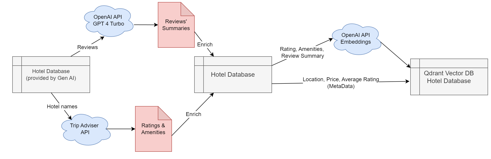
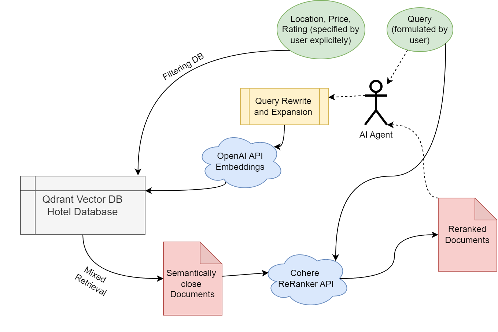
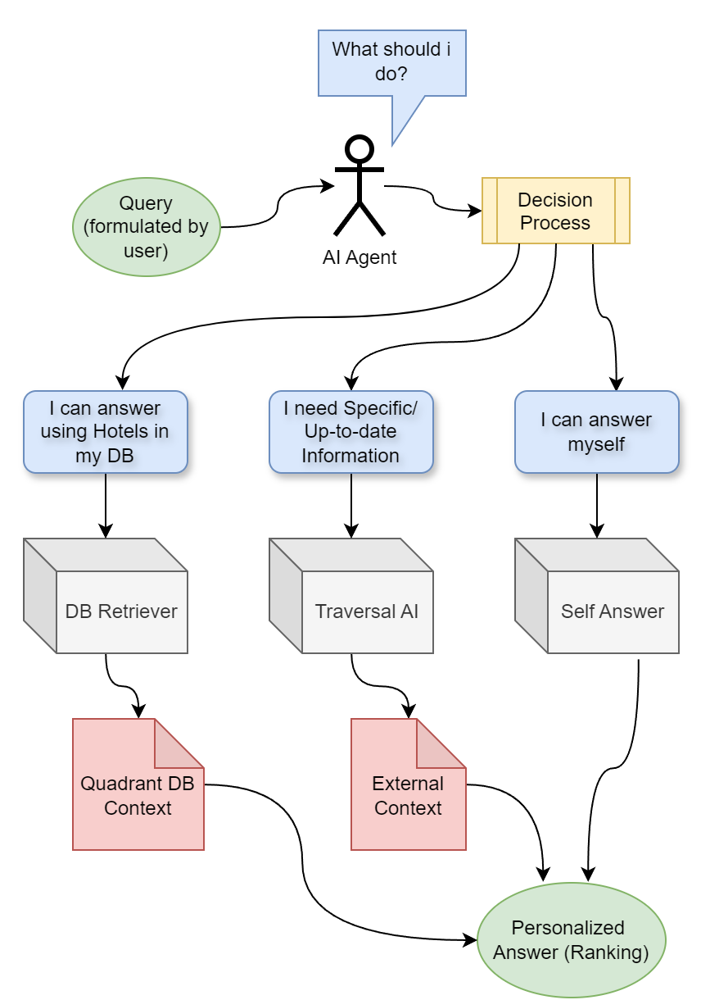

# Hotel Search Assistant

Here we present the smart AI chatbot (Agent), that helps user to find the most suited hotels and relevant information about them, given text query and optional search fields.
We employ OpenAI GPT 4.0 as the backbone for our Agent, create a vector Qdrant DB of hotels enriched by TripAdvisor's features, and utilize an external source of information - Traversaal AI.
Finally, we deploy our model using Streamlit framework.

## Data Enrichment

We have decided to collect the clean description of the hotels, their ratings, and amenities, rather than the raw reviews. This is due to the fact that the raw reviews are not always informative and can be biased.

In the original Hotels dataset, we sorted the positive (rating $\ge$ 4.0) and negative (rating $<$ 4.0) reviews by length, took the top 6 (by length) positive and top 6 negative reviews, and used OpenAI GPT 4.0 to summarize the content of the reviews, specifying strong and weak points mentioned in the reviews. 

In addition to the dataset provided by the Gen AI Hackathon, we enriched our data using the TripAdvisor API [link](https://tripadvisor-content-api.readme.io/reference/overview). We gathered all present amenities (e.g. availability of different features in the hotel like pet-friendly atmosphere or WIFI availability) and rankings, distributed by different aspects of the hotel: location assessment, sleep quality, room assessment, service quality, and cleanliness. 

## DB Construction

As a result, we have one document per unique hotel with a description consisting of metadata (i.e. City, Price range, average Rating) and text: ratings, amenities, and reviews summarization.

To be able to semantically search for the query-related documents we transform the text part in the description into embeddings using the OpenAI Embedding model (text-embedding-3-large). We set up the Qdrant vector database [link](https://qdrant.tech/) with documents, which now consist of metadata and embedding of text description. This would allow us to quickly MixRetrieve hotels' documents, filtered by City, Price, and Rating requirements by the user, as well as ranked by semantic proximity to the user's query (text description of his wishes).

  

## Retrieval Results Reranking

The proximity (closeness) of the retrieved documents in most cases is not perfect, especially their ranking. To mitigate this, we employed the Cohere API ReRanker [link](https://txt.cohere.com/rerank/) model (rerank-multilingual-v2.0), which reevaluates the positions in the ranking of the previously retrieved hotels with respect to the user's text query. In addition to the reevaluation, top _k_ (specified by the user)
hotels are taken for further processing.

## External Information

Since the information present in the hotel vector Database is not sufficient to enfold all possible wishes and questions by the user, we integrate our project with Traversal AI [link](https://docs.traversaal.ai/), which using the question-answer API can provide up-to-date information from the internet. Thus we give access to our Agent to the external information storage.

## Agent

At the core of the project, we create an Agent powered by OpenAI GPT 4.0 model and LangChain framework [link](https://www.langchain.com/):

Upon receiving the user's text query the Agent decides which actions it needs to take. For each communication iteration (receiving a new query/message) the Agent is faced with the following choice: use the Hotel Database (vector DB Qdrant) to retrieve query-related hotels, use the Traversal AI API to ask for additional information that is not present in the local Hotel Database, or answer the question without using any of the tools. 

The communication between the user and the Agent is done in the chat format, where the Agent remembers all the history of the conversation and filter options (metadata) changes made by the user. Independent of where the information is coming from, the Agent will justify and personalize its answer with respect to the user's current request.

After Promt Engineering, we store all the selected prompts in the `src/prompts.py` file.

## Adding new data

To add new data to the Qdrant vector database, you need to run the following command:

~~~
python src/create_vector_db.py
~~~

This script will run the whole pipeline of Data Enrichment. It will collect the data from the TripAdvisor API, summarize the reviews, and create the embeddings for the text. Then it will store the data in the Qdrant vector database.

create_vector_db.py has the following parameters:
- `--dataset-path` - the path to the dataset, the dataset can be csv or huggingface dataset
- `--db-path` - the path to the Qdrant vector database
- `--is-hf` - the flag to specify if the dataset is huggingface dataset
- `--collection-name` - the name of the collection in the Qdrant vector database. The default value is `hotels`.

and some other parameters.

if you want to create the new collection of the embeddings, you need to run the following command:

~~~
python src/create_vector_db.py --collection-name=any_name --dataset-path=any_path
~~~

This will create the new collection with the name `any_name` and `any_path` is the path to the dataset.

## P.S.
Developed by [Dmitry Maksimov](https://www.linkedin.com/in/maksimov-dmitry/), maksimov.dmitry.m@gmail.com and [Ilya Dudnik](https://www.linkedin.com/in/ilia-dudnik-5b8018271/), ilia.dudnik@fau.de